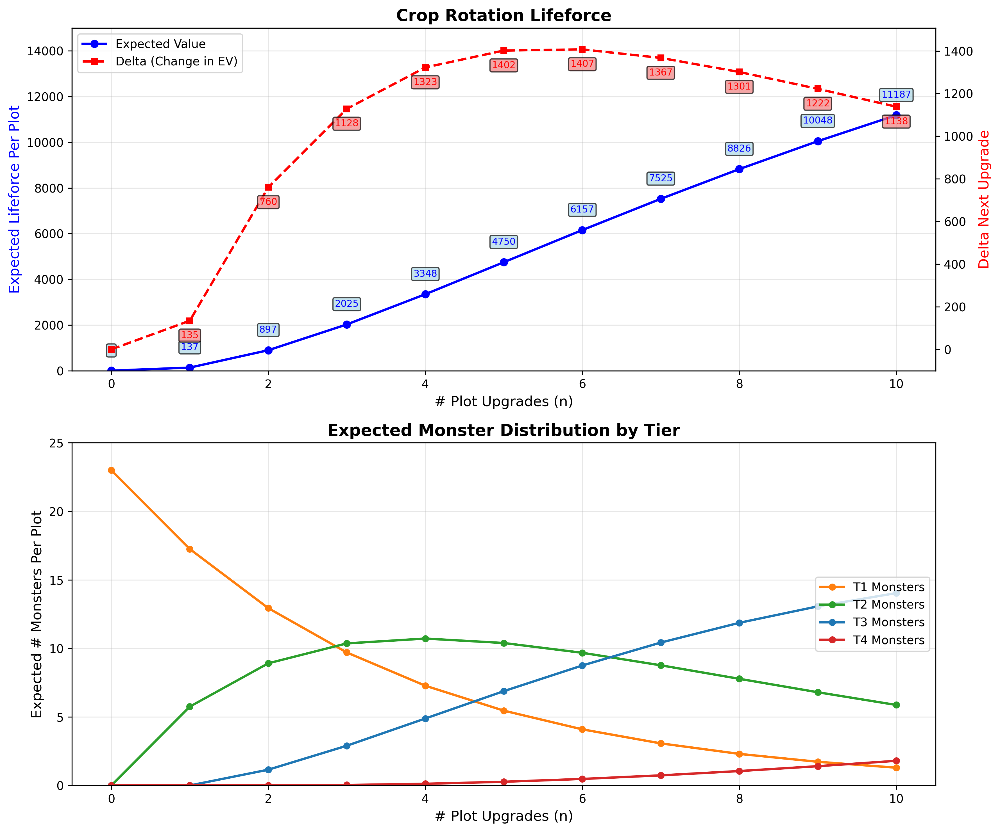

# USAGE

There are two binaries.

## cropbot
`cropbot` can play one game of crop rotation by searching all possible paths through the harvest and calculating the 
expected value, in divine orbs, of each path. It is designed to be used interactively when you enter a harvest to help you pick a path.

Note that it is only computing expected values. You might still have to use your common sense sometimes.

To build from scratch:
`cargo run --release --bin cropbot`

I've also included a standalone .exe for windows in //releases/cropbot.exe

## optimizer

`optimizer` calculates the probability of every initial starting condition, then uses the same functionality as `cropbot` 
to calculate the EV of each starting condition given optimal play.  It emits tables of seed quantities per starting condition.
The weighted sum of these seed quantities is the expected value *per map* under *some configuration of the atlas*.

These tables can definitively answer the question of which configuration of the atlas passives have the best lifeforce yield in the long run.

Note, this is not a simulation. 

https://docs.google.com/spreadsheets/d/1zIGVDc3JEJ-YD6iPIHr6RCD0SCG8S0UAZVvjYkIfGLU/edit?gid=0#gid=0

Credit to BlaydeX15 for helping me with the spreadsheet.

To build from scratch:
`cargo run --bin optimizer --release`

I've also included a standalone .exe at `release/optimizer.exe`
It takes my computer about 10 minutes to output tables for every possible configuration of the atlas.
I also added one particular run of these raw tables, which **ONLY VALID FOR 3.26** or economies with similar ratios of y:b:p prices, in //atlas_tables_3.26.

# MATH

Each individual seed in a plot is a [Markov chain](https://en.wikipedia.org/wiki/Markov_chain) with four states, which we will label $T_1$, $T_2$, $T_3$, and $T_4$.

Under crop rotation, all seeds start in the $T_1$ state. Each time a plot is upgraded (which happens whenever a different-color plot is harvested), the seed transitions to the next state with some probability. This is easiest to represent as a [Markov matrix](https://en.wikipedia.org/wiki/Stochastic_matrix).

Under the transition probabilities [calculated by forgottenarbiter](https://forgottenarbiter.github.io/Poe-Harvest-Mechanics/), this is the left-stochastic transition matrix:

$$
P = \begin{bmatrix}
0.75 & 0 & 0 & 0 \\
0.25 & 0.80 & 0 & 0 \\
0 & 0.20 & 0.97 & 0 \\
0 & 0 & 0.03 & 1
\end{bmatrix}
$$

(Note that in cropbot, transition probabilities are configurable in conf.toml, see `t2_transition`, `t3_transition`, and `t4_transition`.)

At any given time, probability that a seed is in one of hte four states is represented by a 4-d vector where each component represents the probability that the seed is in the corresponding state.

For example, all seeds start in the state 

$$\mathbf{s}_0 = \begin{bmatrix} 1 & 0 & 0 & 0 \end{bmatrix}^T$$

which indicates the certainty of being in state $T_1$.

The evolution of the seed state under successive upgrades follows:

- State after 1 upgrade: $\mathbf{s}_1 = P \mathbf{s}_0$
- State after 2 upgrades: $\mathbf{s}_2 = P \mathbf{s}_1 = P^2 \mathbf{s}_0$
- State after $n$ upgrades: $\mathbf{s}_n = P^n \mathbf{s}_0$

With just these remarks we can plot how many of each type of seed we expect to find in a plot that has been upgraded n times:

Each plot has 23 seeds which evolve independently, so we end up multiplying by 23 when computing plot-level expected values for seeds and divs.

Note that the top graph also has the expected value of a plot upgrade: this multiplies the expected number of seeds by the seed price, so requires us to choose some configuration of conf.toml. This particular chart was made with a configuration approximating mid league 3.25, and is valid only for 3.26 midleague-like conditions.

Also note that you can do better than these expectations by making microadjustments based on how individual games actually evolved. 

## COMPUTING STARTING CONDITIONS

There are up to 10 crops in a 5-plot harvest, each of which can take one of 3 colors each. Before symmetries, that would be $3^{10} = 59,049$ distinct starting conditions.

However, there are important symmetries to exploit:

With any plot pair, the order is irrelevant. $\text{YB} \equiv \text{BY}$ have the same outcomes in terms of expected value.

Furthermore, if two plot pairs of the same pair category appear on the harvest, for the purpose of calculating EV, there is no distinct choice to make between them, which turns out to be significant when optimizing cropbot.exe. In a real game, though, the two identically-colored plot pairs evolve differently and the order of harvesting does matter in a real game, but that's outside the scope of this discussion.

Anyway, there are 6 distinct pair kinds that can occur in starting conditions:

$$\{\text{YY}, \text{YB}, \text{YP}, \text{BB}, \text{BP}, \text{PP}\}$$

We now need to fill $n$ spawn points with these 6 pair kinds, with replacement. Under the rules of the game:
- $n = 3$ with probability $p = 0.25$
- $n = 4$ with probability $p = 0.5$
- $n = 5$ with probability $p = 0.25$

This is classic balls-and-bins from combinatorics, but you have to notice that the *spawn points* are the *stars* and the *pair kinds* are the *bins*. The spawn points are *indistinguishable* but the pair kinds *are distinguishable*.

For example, suppose we lay out the bins like this:

$$\boxed{\text{YY}} \quad \boxed{\text{YB}} \quad \boxed{\text{YP}} \quad \boxed{\text{BB}} \quad \boxed{\text{BP}} \quad \boxed{\text{PP}}$$

Then, we distribute the stars among the bins using bars to depict the bins according to the [stars and bars theorem](https://en.wikipedia.org/wiki/Stars_and_bars_(combinatorics)). For example:

$$\star\star \mid \star \mid \star \mid \mid \mid \star$$

This represents a starting condition of $[\text{YY}, \text{YY}, \text{YB}, \text{YP}, \text{PP}]$.

*(Ohh, that's a juicy one, exile!)*

By the stars and bars theorem, since we only have two types of things to distribute now, we can use the binomial coefficient.

If you do this math for $n = 5$ spawn points and $k = 6$ pair kinds, we have the number of distinct starting conditions with 5 spawn points:

$$\binom{n + k - 1}{k - 1} = \binom{5 + 6 - 1}{6 - 1} = \binom{10}{5} = 252$$

For four spawn point starting conditions ($n = 4$):
$$\binom{4 + 6 - 1}{6 - 1} = \binom{9}{5} = 126$$

For three spawn point starting conditions ($n = 3$):
$$\binom{3 + 6 - 1}{6 - 1} = \binom{8}{5} = 56$$

After symmetries, there is a tractably small number of distinct starting conditions, so we can analytically solve this.

We assume that the color choice of each plot is selected independently with probabilities $p_Y$, $p_B$, $p_P$, which are affected by atlas passives.

We assume that the atlas passives affect the relative weighting of each plot color. For example, suppose that each plot starts with weight 100, but we allocated purple in the atlas, so that it gets 45% reduced chance to spawn, and the large blue node, so it has 25% reduced chance to spawn.

Then the relative weights are $100:75:55$. We normalize this into probabilities:

$$p_Y = \frac{100}{100 + 75 + 55} = \frac{100}{230} \approx 0.435$$
$$p_B = \frac{75}{100 + 75 + 55} = \frac{75}{230} \approx 0.326$$
$$p_P = \frac{55}{100 + 75 + 55} = \frac{55}{230} \approx 0.239$$

Given this, we can compute the probability of any harvest configuration. For a harvest with $y$ yellow plots, $b$ blue plots, and $p$ purple plots:

$$P(\text{harvest}) = \binom{y+b+p}{y,b,p} \cdot p_Y^y \cdot p_B^b \cdot p_P^p$$

where $\binom{y+b+p}{y,b,p}$ is the multinomial coefficient.

...this is exactly what optimizer does.
